# Social App Frontend

Frontend часть социального приложения с системой друзей и уведомлений.  
Проект реализован на **React + TypeScript + Vite**, с использованием **Redux Toolkit / RTK Query** и современного подхода к управлению состоянием и API.

---

## Основной функционал

- Авторизация пользователя через **cookies** с полным управлением сессией
- Регистрация с **подтверждением через OTP код на почту**
- Восстановление пароля через email
- Интерцептор Axios для автоматического обновления **refresh token**
- Система уведомлений:
  - Принятие / отклонение заявок в друзья
  - Удаление одного уведомления
  - Удаление всех уведомлений
- Список друзей и отправленных заявок
- Мгновенное обновление UI через **RTK Query**
- Маршрутизация через **React Router v6** с вложенными путями
- UI-иконки с помощью библиотеки **Lucide**

---

## Стек технологий

- **React** + **TypeScript**
- **Vite** (быстрая сборка и HMR)
- **Redux Toolkit** + **RTK Query** (работа с состоянием и API)
- **Axios** (HTTP-клиент с интерцепторами)
- **React Router v6** (вложенные маршруты)
- **Lucide** (иконки)
- **Framer Motion** (анимации)
- **CSS Modules**

## Backend

Проект подключается к backend, который реализован на:

- **Java + Spring Boot** — REST API и бизнес-логика
- **PostgreSQL** — основная база данных
- **Redis** — кеширование и хранение сессий
- **Docker** — контейнеризация для быстрого развертывания

> Backend должен быть запущен на `http://localhost:8080`

---

## Архитектура проекта

- Feature-based структура (по функционалу)
- RTK Query для работы с API и кешированием
- Оптимистичные обновления UI при удалении уведомлений
- Инвалидация кэша вместо ручного refetch
- Axios interceptors для автоматического обновления refresh token
- React Router v6 для вложенной маршрутизации

## UI / UX особенности

- Всплывающие уведомления с анимацией через Framer Motion
- Отображение ошибок авторизации / регистрации в UI
- Реализация OTP-кода для подтверждения email при регистрации
- Интерактивные кнопки с иконками Lucide

## Статус проекта

- В разработке 🚧
- Полностью рабочий frontend с авторизацией и системой уведомлений
- Backend должен быть подключён для полной функциональности

## Что было изучено

- Работа с RTK Query и кэшированием
- Построение feature-based архитектуры
- Настройка Axios interceptors для refresh token
- Реализация React Router с вложенными путями
- Работа с UI-библиотекой Lucide
- Реализация регистрации с OTP-кодом и восстановлением пароля

## Планы по развитию

- Реализация WebSocket уведомлений
- Pagination и фильтры для уведомлений
- Улучшение UX и анимаций
- Мобильная адаптация интерфейса

## Скриншоты

| Авторизация                             | Регистрация                                   | Восстановление пароля                               |
| --------------------------------------- | --------------------------------------------- | --------------------------------------------------- |
| 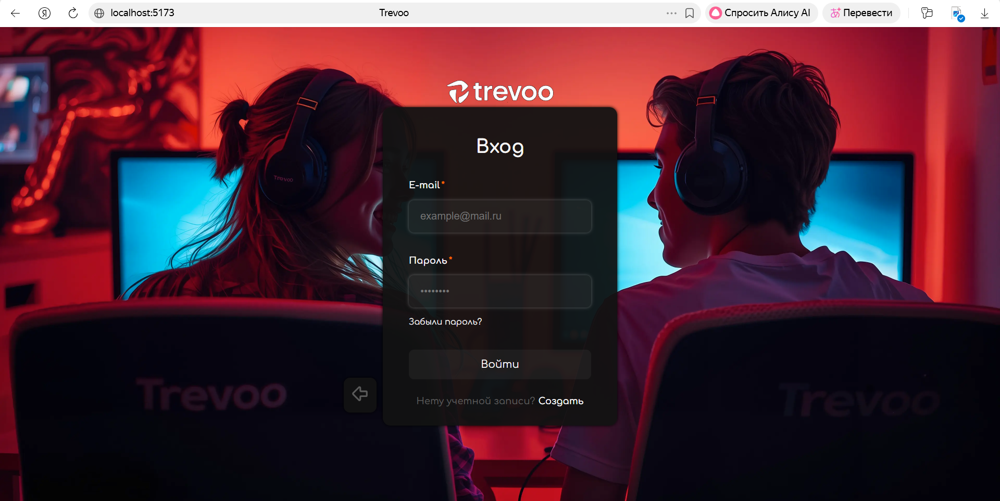 | 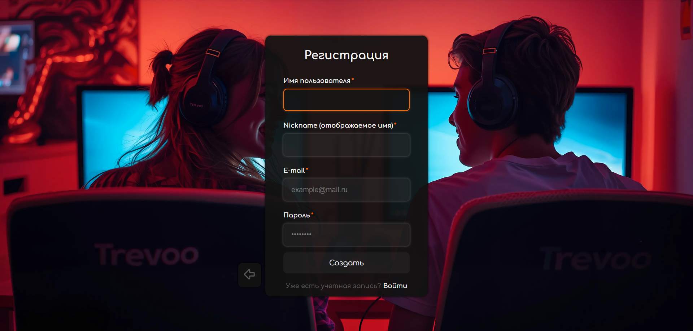 | 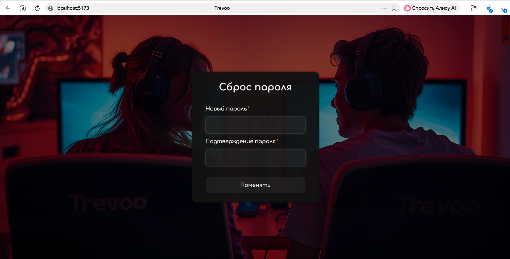 |

| Loading состояния                      | Ошибка регистрации                                 | OTP-подтверждение                         |
| -------------------------------------- | -------------------------------------------------- | ----------------------------------------- |
| 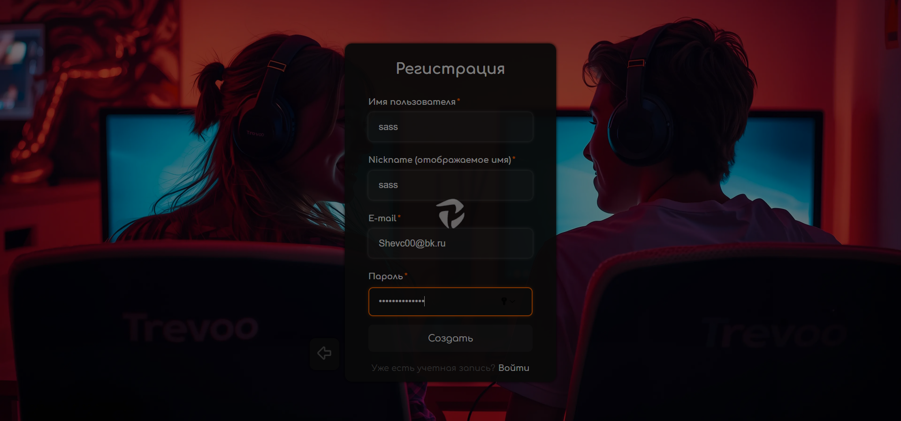 | 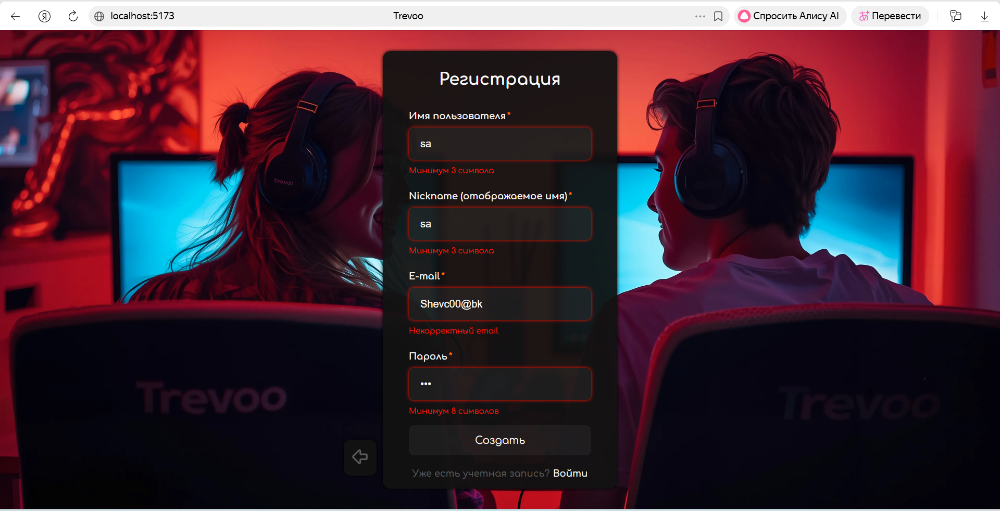 | 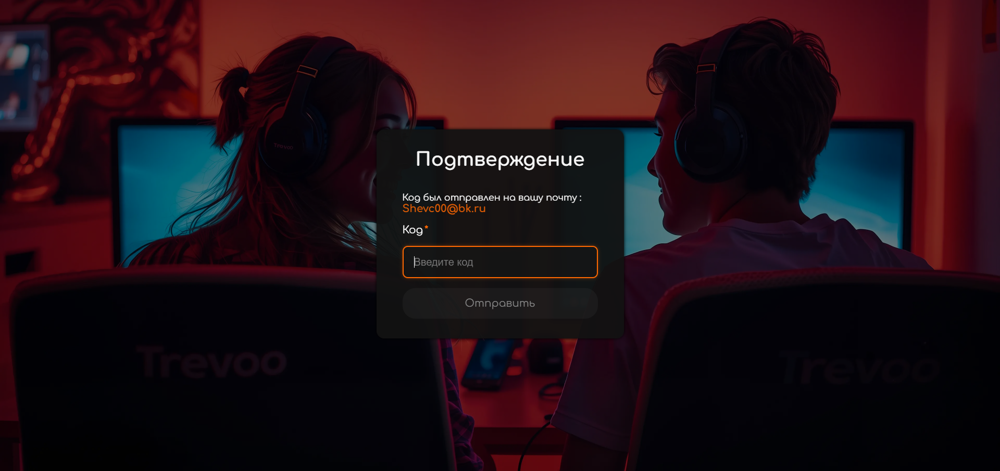 |

| Notification Reset                                         | Notification                                     | Main                             |
| ---------------------------------------------------------- | ------------------------------------------------ | -------------------------------- |
| 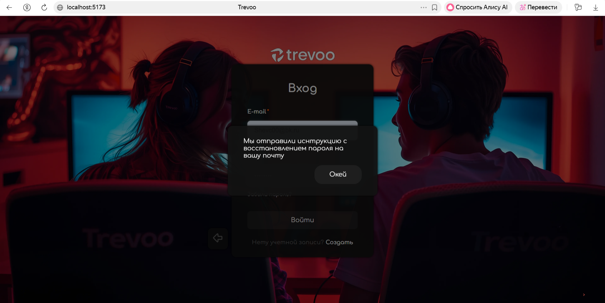 | 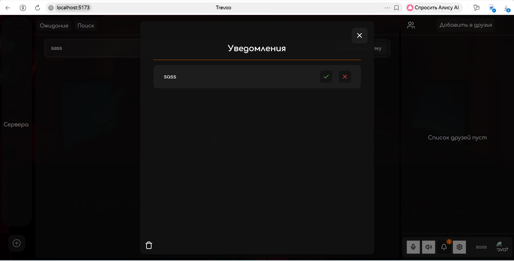 | 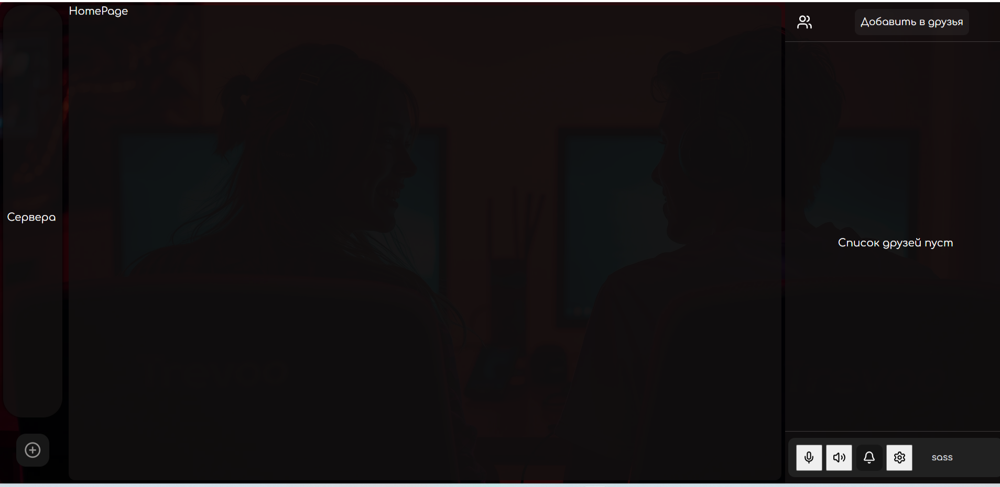 |

| Home Page                                | Create Modal                                               | Reset Mail                                 | OTP Mail                               |
| ---------------------------------------- | ---------------------------------------------------------- | ------------------------------------------ | -------------------------------------- |
| 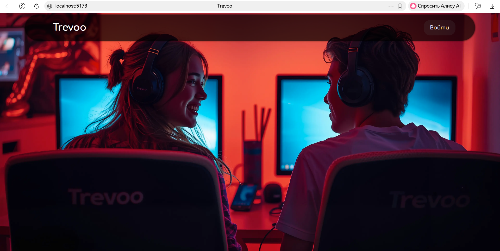 | 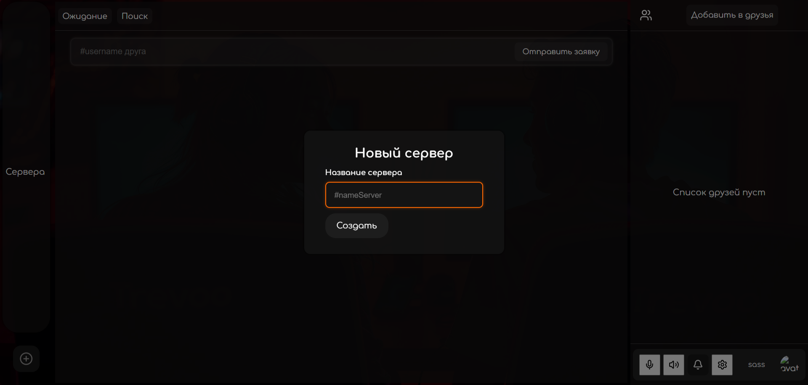 | 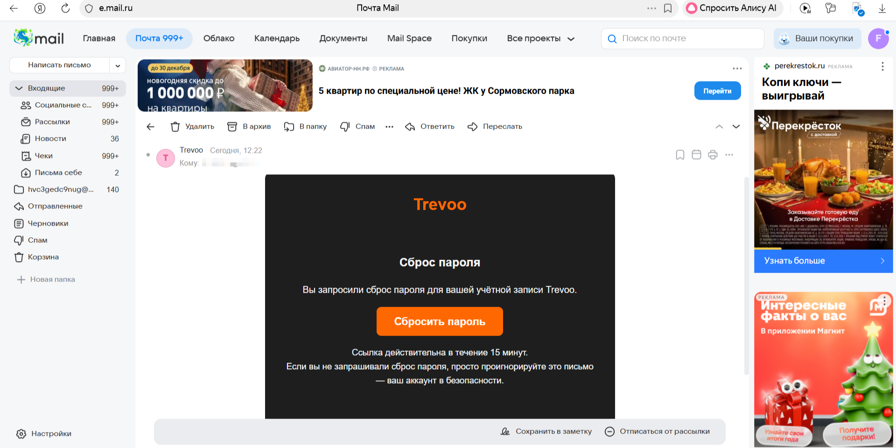 | 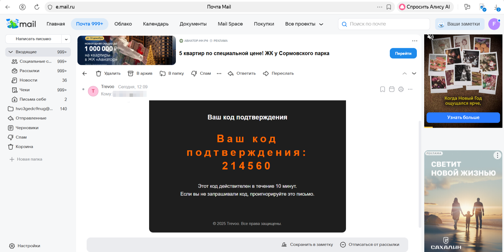 |

## ⚙️ Установка и запуск

```bash
# Клонируем репозиторий
git clone https://github.com/your-username/social-app-frontend.git
cd social-app-frontend

# Установка зависимостей
npm install

# Запуск в режиме разработки
npm run dev

```
